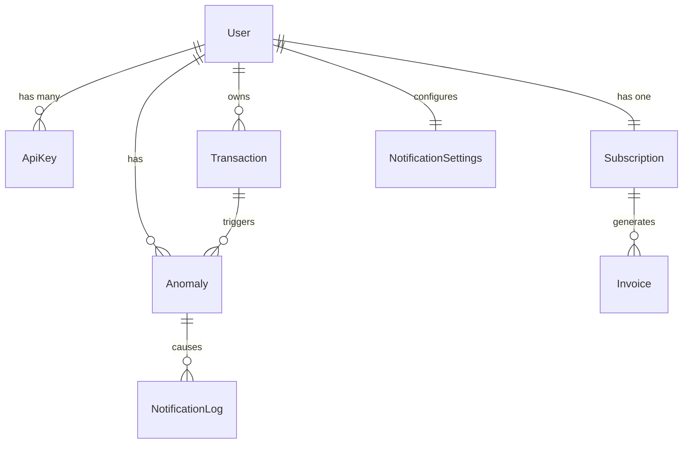

# Database Schema Documentation

## 📖 Overview
This document explains the data model for **Anomalyze**, designed for a production-grade, event-driven architecture. The schema is implemented using **Prisma ORM** and targets a **PostgreSQL** database (Neon).

The schema is modular, with tables grouped by the microservice that primarily owns them, though data is often joined for analytics.

---

## 🏗 Domain Breakdown

### 1. Identity & Access Management (Auth Service)
**Primary Owner**: `auth-service`

*   **`User`**: The central entity.
    *   `id`: String, maps directly to the **Clerk User ID** (e.g., `user_2q3X...`).
    *   Acts as the root for all other data (transactions, subscriptions, alerts).
*   **`ApiKey`**: Manages programmatic access for the Ingestion API.
    *   `keyHash`: Stores the **bcrypt hash** of the secret key. The actual secret is never stored.
    *   `keyPrefix`: First 7 characters (e.g., `sk_live`) for easy identification in logs without exposing the secret.
    *   `scopes`: Array of strings defining permissions (e.g., `["ingest:write"]`).
*   **`AuditLog`**: Security trail for sensitive actions (login, plan change, key creation).

### 2. Billing & Entitlements (Subscription Service)
**Primary Owner**: `subscription-service`

*   **`Subscription`**: Tracks the user's current plan and status.
    *   `razorpaySubscriptionId`: Links to the recurring billing schedule in Razorpay.
    *   `status`: `ACTIVE`, `HALTED` (payment failed), `CANCELED`.
    *   `features`: JSON blob caching current entitlements (e.g., `{ "voice_alerts": true }`) to avoid complex joins during high-speed checks.
*   **`Invoice`**: Represents a generated bill.
    *   `pdfUrl`: Points to the PDF stored in **AWS S3 / Cloudflare R2**.
    *   `status`: `GENERATED`, `PENDING`.
*   **`PaymentLog`**: Raw log of Razorpay webhooks for debugging and auditing.

### 3. Core Data (Ingestion Service)
**Primary Owner**: `ingestion-service`

*   **`Transaction`**: The raw financial event.
    *   `txId`: External ID from the source system (deduplication key).
    *   `source`: `REALTIME_API` or `BATCH_CSV`.
    *   Indexed by `[userId, timestamp]` for fast time-series queries.
*   **`BatchJob`**: Tracks the status of large CSV uploads.
    *   `r2Key`: Path to the raw file in Object Storage.
    *   `status`: `PROCESSING`, `COMPLETED`, `FAILED`.

### 4. Detection Engine (ML Service)
**Primary Owner**: `ml-service`

*   **`Anomaly`**: A detected irregularity.
    *   `score`: The ML probability (0.0 - 1.0).
    *   `severity`: `LOW` to `CRITICAL`.
    *   `ruleViolations`: Which deterministic rules triggered (e.g., `["VELOCITY_HIGH"]`).
    *   `isFalsePositive`: Feedback loop field. If `true`, this record is used to retrain the model to ignore similar patterns.
*   **`ModelArtifact`**: Registry of trained ML models.
    *   `version`: Semantic version (e.g., `v1.2.0`).
    *   `s3Path`: Location of the serialized model (`.pkl` / `.onnx`) in the Data Lake.
    *   `isActive`: Flag to determine which model consumers should load.

### 5. Notifications (Notification Service)
**Primary Owner**: `notification-service`

*   **`NotificationSettings`**: User preferences.
    *   `phoneEnabled`: Gatekeeper for Voice Calls (Pro feature).
    *   `minSeverityForCall`: Threshold (e.g., only call for `CRITICAL`).
*   **`NotificationLog`**: Delivery history.
    *   `channel`: `EMAIL`, `VOICE`, `SMS`.
    *   `status`: `SENT`, `FAILED`.
    *   `metadata`: Stores provider responses (e.g., Twilio Call SID).

### 6. Analytics & Reporting (Analytics Service)
**Primary Owner**: `analytics-service`

*   **`Report`**: Async export jobs.
    *   `fileUrl`: S3 link to the generated CSV/PDF report.
    *   `status`: `PROCESSING`, `COMPLETED`.

---

## 🔑 Key Design Decisions

1.  **String IDs for Users**: We use Strings instead of Integers for `User.id` to support external Identity Providers (Clerk) directly without a mapping table.
2.  **JSON for Features**: The `Subscription.features` column uses `JSONB`. This allows us to add new feature flags (e.g., "beta_access") without running database migrations.
3.  **Separation of Blob Storage**: Large files (Invoices, Reports, Model Artifacts, Batch CSVs) are **not** stored in the database. We only store the **S3/R2 URL** (`fileUrl`, `s3Path`) to keep the DB light and fast.
4.  **Enums for State**: Strict Enums (`SubscriptionStatus`, `Severity`, `JobStatus`) are used to prevent invalid state transitions in code.

---

## 🔄 Relationships Diagram (Conceptual)

